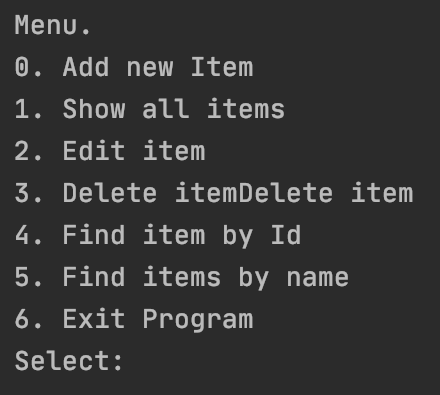
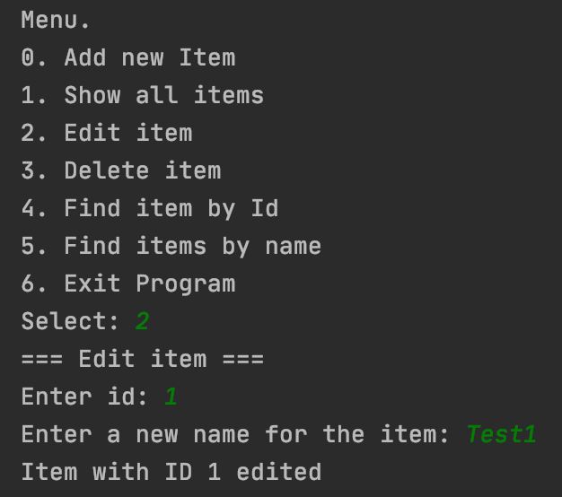
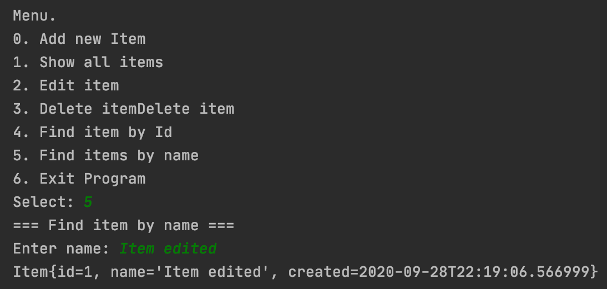

# О проекте 
 &nbsp;&nbsp;

Предназначен для закрепления знаний, полученных при изучении блока посвященного ООП из <a href="https://github.com/ReyBos/job4j_elementary">курса по основам языка Java</a>.

Этот проект - консольное приложение. После запуска пользователю отображается меню с возможностями программы. Программа просит ввести в консоль пункт меню для дальнейшего действия. Например, пользователь ввел цифру 0. Система просит пользователя ввести имя заявки. После этого действия система сохраняет в памяти заявку и снова отображает пункты меню. Если пользователь выбрал пункт 6 - это будет выход из программы, т.е. программа закрывается.

  
  
  

<h2>Структура проекта</h2>
<ul>
  <li>Данные будут храниться в памяти. Хранилище будет описывать класс <a href="https://github.com/ReyBos/job4j_tracker/blob/master/src/main/java/ru/job4j/tracker/Tracker.java">ru.job4j.tracker.Tracker</a></li>
  <li><a href="https://github.com/ReyBos/job4j_tracker/blob/master/src/main/java/ru/job4j/tracker/Item.java">ru.job4j.tracker.Item</a> объект этого класса будет описывать модель данных</li>
  <li>Объект для управления меню <a href="https://github.com/ReyBos/job4j_tracker/blob/master/src/main/java/ru/job4j/tracker/StartUI.java">ru.job4j.tracker.StartUI</a></li>
</ul>
<h2>Интересные моменты</h2>
<ul>
  <li><a href="https://github.com/ReyBos/job4j_tracker/commit/a58d1785c10198cda033c863257130bc39d99a83">Удалили зависимость</a> StartUI от внешних ресурсов (Scanner)</li>
  <li><a href="https://github.com/ReyBos/job4j_tracker/commit/fd96dec057015d842fd711148bea39398baa3eff">Удалили зависимость</a> классов от внешних ресурсов (System.out)</li>
  <li>Реализовали StartUI за счет <a href="https://github.com/ReyBos/job4j_tracker/commit/4e623b37c1e3905dcba94e4855a374b7c3c7609e">шаблона стратегия</a>. Этот шаблон позволяет изменить алгоритм работы программы в запущенной программе</li>
  <li><a href="https://github.com/ReyBos/job4j_tracker/commit/3d2b5d99ad0946027da1638f5916ff73d133792d">Шаблон декоратор</a> для валидатора. Смысл Декоратора - добавление нового поведения в уже существующее поведение</li>
  <li>Шаблон фабричный метод. Смысл этого шаблона в создании метода, который создает новый экземпляр объекта. Шаблон абстрактная фабрика. Главное отличие от фабричного метода, абстратная фабрика это интерфейс, который содержит абстратные методы для создания экземплятов.</li>
</ul>
<h3>Singleton</h3>

<a href="https://github.com/ReyBos/job4j_tracker/commit/d0a45990f29985c67a8ff15816abb7792bd0496a">Шаблон singleton</a> - используется для создания класса, который может содержать только один экземпляр объекта в виртуальной машине. Шаблон singleton применять в проектах, где используются работы с внешними ресурсами: базы данных, серверы. Шаблон может быть с ленивой и энергичной загрукой.

<ul>
  <li>Ленивая загрузка (Lazy loading) происходит, когда мы явно обращаемся к объекту. Происходит его загрузка.</li>
  <li>Энергичная загрузка (Eager loading) - загружает объект сразу после старта виртуальной машины.</li>
</ul>
<h4>Варианты реализации</h4>
<ol>
  <li><a href="https://github.com/ReyBos/job4j_tracker/blob/master/src/main/java/ru/job4j/tracker/TrackerSingleEnum.java">enum</a>. Eager loading.</li>
  <li><a href="https://github.com/ReyBos/job4j_tracker/blob/master/src/main/java/ru/job4j/tracker/TrackerSingleField.java">static field</a>. Lazy loading.</li>
  <li><a href="https://github.com/ReyBos/job4j_tracker/blob/master/src/main/java/ru/job4j/tracker/TrackerSingleFinalField.java">static final field</a>. Eager loading.</li>
  <li><a href="https://github.com/ReyBos/job4j_tracker/blob/master/src/main/java/ru/job4j/tracker/TrackerSingleFinalClass.java">private static final class</a>. Lazy loading.</li>
</ol>
